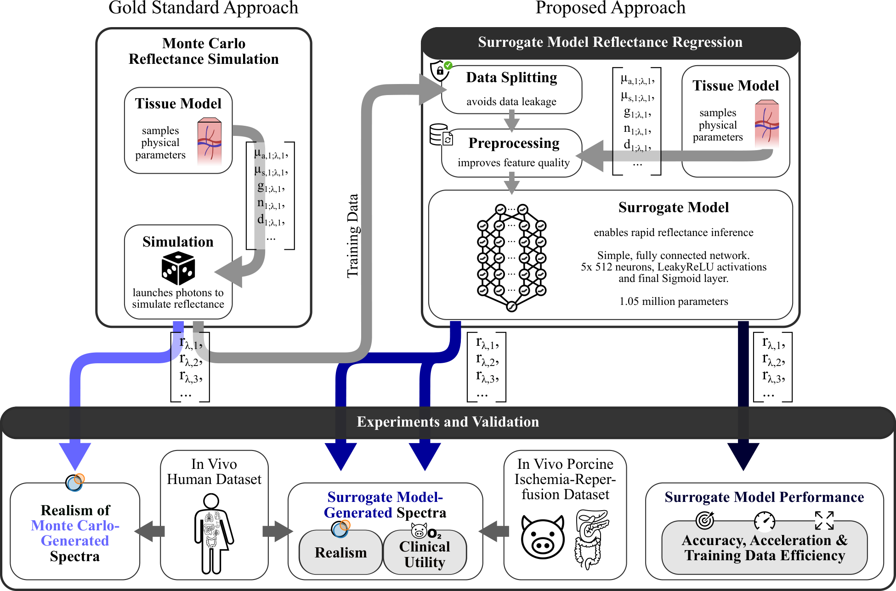

# Learning to simulate realistic human diffuse reflectance spectra (mcmlnet)

[](https://www.python.org/downloads/)
[](https://opensource.org/licenses/MIT)
[](https://github.com/astral-sh/ruff)
[](https://github.com/IMSY-DKFZ/mcmlnet)
[](https://doi.org/10.1117/1.JBO.31.2.026004)
[](https://doi.org/10.5281/zenodo.18847366)

**mcmlnet** implements training and inference of neural surrogate models to accelerate multilayer Monte Carlo tissue-optics simulations, enabling rapid prototyping, real-time inference, and large-scale experiments in medical imaging.

<p align="center" style="font-size: larger;">
  <a href="https://doi.org/10.1117/1.JBO.31.2.026004">📄 Paper: Learning to simulate realistic human diffuse reflectance spectra</a>
</p>



## Key Features

- **Reflectance Inference**: Neural network inference and Monte Carlo reflectance computation with NumPy/Pandas compatibility, supporting 1-3 tissue layers
- **Comprehensive Evaluation**: Model scaling analysis, PCA analysis, spectral recall comparison, and performance benchmarking
- **Explainability**: SHAP-based model interpretability
- **Multiple Architectures**: Support for fully connected networks and Kolmogorov-Arnold Networks (KAN)
- **Surrogate Model (Re-)Training**: PyTorch Lightning-based training pipelines for forward surrogate models
- **Hyperparameter Tuning**: Hyperparameter optimization with Optuna and advanced optimizers (Sophia)

## Table of Contents

* [Getting Started](#getting-started)
* [Inference Example](#example-surrogate-model-inference)
* [Usage and Reproducibility](#usage)
* [Configuration](#configuration)
* [Project Structure](#project-structure)
* [Testing](#testing)
* [External Code and Attributions](#external-code-and-attributions)
* [License](#license)
* [Citation](#citation)
* [Funding](#funding)

## Getting Started

### Installation

Install necessary dependencies, including [mcmlgpu](https://github.com/IMSY-DKFZ/mcmlgpu), which has to be built from source.

> *Note: This repository was tested with CUDA 13.0 on Ubuntu 22.04 LTS using an AMD Ryzen 9 5900X, NVIDIA GeForce RTX 3090, and 128 GB DDR4 RAM. For broader CUDA compatibility, you may prefer using Conda or Mamba (using the `pyproject.toml` directly) as your package and CUDA version manager over uv + pip.*

```bash
# 1. Install uv (Linux/macOS) - for further information see https://docs.astral.sh/uv/getting-started/installation/
curl -Ls https://astral.sh/uv/install.sh | sh

# 2. Create and activate a named virtual environment with python 3.12
uv venv --python 3.12
source .venv/bin/activate

# 3. Install project for regular usage
uv sync --extra cuml-cu13 --extra real_data

# 4. Optionally install fastkde for PCA KDE plots
uv pip install "fastkde>=2.1.0"  # R&D, NON-COMMERCIAL USE ONLY LICENSE
```

<details closed>
<summary>cuML installation instructions for CUDA 12</summary>

```bash
# Or see the RAPIDS install selector: https://docs.rapids.ai/install/#selector
pip install "cuml-cu12>=25.8.0"
```

</details>

### Environment Setup

To create your own environment configuration, copy the `.env.example` template file to `.env` and fill in the appropriate paths and values.

### Model and Data Download

Pre-trained models and synthetic reflectance data are available in our [Zenodo data repository](https://doi.org/10.5281/zenodo.18847366). Place the `data` folder at the root of this repository and add its path to the `.env`, or store it elsewhere and point the `.env` to your preferred location.

### Example Surrogate Model Inference

The notebook `quickstart_surrogate_inference.ipynb` introduces a simple inference function running "end‑to‑end", as well as the fully customizable surrogate model pipeline, including physiological and physical optical parameter definition, preprocessing, and custom batched inference with or without access to gradients.

For further examples, also check out `mcmlnet/data_gen/surrogate_model_inference.ipynb` and `mcmlnet/experiments/timings.ipynb`.

### Developer Usage

> [Optional/ Developer] For compute emission tracking, please follow the [installation](https://mlco2.github.io/codecarbon/installation.html) and [quickstart](https://mlco2.github.io/codecarbon/usage.html) guidelines of [codecarbon](https://codecarbon.io/).

Additionally, please install other formatting, linting, ... tools via:

```bash
# 4. Optional, install dev dependencies and pre-commit tools
uv sync --all-extras
uv run pre-commit install
```

## Usage

> All scripts were executed on a workstation with 128 GB RAM, AMD Ryzen 9 5900X 12-Core Processor, and NVIDIA GeForce RTX 3090 GPU. While the codebase is compatible with systems featuring smaller GPUs, 64 GB RAM are recommended for memory-intensive data processing.

### Run Surrogate Model Inference

The primary inference helpers are located in `utils/convenience.py`: `run_model_from_physical_data` provides a basic workflow, while `predict_in_batches` offers full control, once the model checkpoints are downloaded.

### Reproducing the Publication

#### Reflectance Data Generation

To run Monte Carlo simulations, follow the installation guidelines of [mcmlgpu](https://github.com/IMSY-DKFZ/mcmlgpu) first. The full Monte Carlo reflectance data generation **will take weeks** if not using many `n_runs` and distributing across multiple machines!

```bash
# Generate surrogate model development and tissue model data
python mcmlnet/data_gen/physiological_data_script.py --run_id=0 --n_runs=1 --batch_size=1000

# Generate physical generalization data
python mcmlnet/data_gen/physical_generalization_data_script.py --run_id=0 --n_runs=1 --batch_size=100

# Generate empirical validation data
python mcmlnet/data_gen/empirical_validation_1000M_photons_script.py --run_id=0 --n_runs=1 --n_batches=1000 --data_type=physio --data_split=test
```

For related work data reproduction, run `mcmlnet/data_gen/related_work_resimulation.ipynb`. Due to the smaller dataset sizes and fewer photons, this notebook is supposed to only run for a few hours.

#### Surrogate Model Training

For more configuration details, see [the configuration section of the readme](#configuration). Typical network training, depending on machine and training dataset size, should finish within 30-100 minutes.

```bash
# Basic training with adaptable hydra config
python mcmlnet/training/optimization/optimizer.py

# Train with KAN architecture (change model config)
python mcmlnet/training/optimization/optimizer.py --config-name default model=forward_surrogate_kan
```

#### Related Work Model Training

Fitting an analytical model and training a neural network for related work models can be done within two to three hours runtime.

Execute/ run all cells of:
- `mcmlnet/training/optimization/fit_analytical_baselines.ipynb`
- `mcmlnet/training/optimization/related_work_neural_network_training.ipynb`

#### Model Inference

Execute/ run all cells of `mcmlnet/data_gen/surrogate_model_inference.ipynb` (10-15 min).

#### Model Evaluation

To compare the runtime, run `mcmlnet/experiments/timings.ipynb`. For the other results execute:

```bash
# Evaluate final model performance
python mcmlnet/experiments/evaluate_final_model.py

# Analyze neural scaling behavior
python mcmlnet/experiments/discover_models.py
python mcmlnet/experiments/evaluate_scaling_models.py
python mcmlnet/experiments/evaluate_related_scaling_models.py

# Examine sensibility of surrogate model using shapley values
python mcmlnet/experiments/explainability.py
```

#### Human and Porcine Data-Based Evaluations

The underlying human HSI data are not publicly shared due to legal and ethical restrictions. The inference scripts and notebooks below are provided for completeness and transparency but cannot be executed without access to the experimental HSI data.

```bash
# Perform PCA analysis
python mcmlnet/experiments/spectral_pca_analysis.py

# Compute spectral recall
python mcmlnet/experiments/spectral_recall_analysis.py
```

The `qualitative_oxygenation_knn_eval.ipynb` notebook evaluating the porcine aortic clamping experiments is included for methodological reference, however, the clinical dataset is not publicly available (yet). Access to the executed notebook or aggregated results may be requested from the authors.

## Configuration

The project uses Hydra for configuration management. Key configuration files are located in `mcmlnet/training/configs/`:

- **Model configurations**: Define network architectures and hyperparameters
- **Data processing**: Configure data loading, augmentation, and preprocessing
- **Training modes**: Switch between training, tuning, and evaluation modes

## Project Structure

```bash
mcmlnet/
│
├── assets/                         # Project assets and figures
│   ├── concept_figure.png
│   ├── LOGO_ERC-FLAG_EU_.jpg
│   └── tissue_model.png
│
├── cache/                          # Cached computation results
├── data/                           # Data storage
│   ├── raw/                        # Raw Monte Carlo simulation data
│   │   ├── base_physio_and_physical_simulations/  # Base simulation data
│   │   ├── inference/              # Inference data
│   │   ├── optical_components/     # Camera filter and irradiance data
│   │   └── related_work_reimplemented/  # Related work data
│   ├── models/                     # Trained model checkpoints
│   └── chromophores/               # Domain-specific optical properties
│
├── mcmlnet/                        # Main package
│   ├── data_gen/                   # Data generation scripts
│   │   ├── physiological_data_script.py      # Main surrogate development data generation script
│   │   ├── physical_generalization_data_script.py  # Physical parameter data generation script
│   │   ├── empirical_validation_10x_photon_amount_script.py  # Empirical validation script
│   │   ├── generate_final_data_spec.py       # Final data specification generator
│   │   ├── related_work_resimulation.ipynb   # Related work simulation dataset notebook
│   │   ├── surrogate_model_inference.ipynb   # Model inference data generation notebook
│   │   └── camera_adaptation.py    # Camera adaptation utilities
│   │
│   ├── experiments/                # Analysis and evaluation
│   │   ├── data_loaders/           # Data loading utilities
│   │   │   ├── aggregation.py      # Data aggregation utilities
│   │   │   ├── config.py           # Data loader configuration
│   │   │   ├── porcine_clamping_data.py  # Porcine clamping experiments data loading
│   │   │   ├── real_data.py        # Real data loading
│   │   │   ├── simulation.py       # Simulation data loading
│   │   │   └── utils.py            # Data loader utilities
│   │   ├── discover_models.py      # Model discovery utilities
│   │   ├── evaluate_final_model.py     # Final model evaluation
│   │   ├── evaluate_scaling_models.py  # Neural scaling analysis
│   │   ├── evaluate_other_scaling_models.py  # Neural scaling analysis for different photon amount
│   │   ├── evaluate_related_scaling_models.py  # Related work scaling analysis
│   │   ├── explainability.py           # 3D Model surface and SHAP analysis
│   │   ├── get_dataset_statistics.py   # Dataset statistics
│   │   ├── plot_scaling_results_appendix.py  # Appendix plotting
│   │   ├── plot_scaling_results.py     # Scaling results plotting
│   │   ├── plotting.py                 # General plotting utilities
│   │   ├── qualitative_oxygenation_knn_eval.py  # Clinical experiment using surrogate model and simulation oxygenation lookup
│   │   ├── spectral_pca_analysis.py    # PCA analysis of spectra
│   │   ├── spectral_recall_analysis.py # Recall analysis
│   │   ├── timings.ipynb           # Performance timing analysis
│   │   └── utils.py                # Utility functions
│   │
│   ├── susi/                       # SUSI simulation framework
│   │   ├── adapt_to_camera.py      # Camera filter transformation
│   │   ├── calculate_spectra.py    # Spectral calculations
│   │   ├── sim.py                  # Core simulation engine queries
│   │   └── usuag.py                # Usage utilities
│   │
│   ├── training/                   # Training infrastructure
│   │   ├── configs/                # Configuration files
│   │   │   ├── data_and_processing/  # Data processing configs
│   │   │   ├── mode/               # Training mode configs
│   │   │   ├── model               # Model architecture configs
│   │   │   └── default.yaml        # config base
│   │   │
│   │   ├── data_loading/           # Data handling
│   │   │   ├── data_augmentation_classes.py  # Augmentation class definitions
│   │   │   ├── data_augmentation.py  # Augmentation functions
│   │   │   ├── data_module.py      # PyTorch Lightning DataModule
│   │   │   ├── datasets.py         # Dataset classes
│   │   │   ├── preprocessing.py    # Data preprocessing pipeline
│   │   │   └── sota_data_classes.py  # State-of-the-art dataset handling
│   │   │
│   │   ├── models/                 # Neural network architectures
│   │   │   ├── base_model.py       # Base PyTorch Lightning model
│   │   │   ├── kan_model.py        # KAN-specific model implementation
│   │   │   ├── kan.py              # KAN network implementation
│   │   │   └── network_constructor.py  # Network building blocks
│   │   │
│   │   ├── optimization/           # Training optimization
│   │   │   ├── analytical_baselines.py  # Analytical baseline models
│   │   │   ├── fit_analytical_baselines.ipynb  # Baseline fitting notebook
│   │   │   ├── optimizer.py        # Main training script
│   │   │   ├── optuna_hp_opt.py    # Hyperparameter optimization
│   │   │   ├── related_work_neural_network_training.ipynb  # Related work training
│   │   │   └── sophia_optimizer.py  # Sophia optimizer implementation
│   │   │
│   │   ├── plotting.py             # Training plotting utilities
│   │   └── flop_and_gmac_counting.py  # Computational complexity analysis
│   │
│   ├── transforms/                 # Data transformations
│   │   ├── physiological.py        # Physiological transformations
│   │   └── related_work_transformations.py  # Literature-based transforms
│   │
│   └── utils/                      # Utility functions
│       ├── caching.py              # Caching mechanisms
│       ├── convenience.py          # Convenience functions and surrogate model "API"
│       ├── haemoglobin_extinctions.py  # Haemoglobin extinction data
│       ├── knn_cuml.py             # CUML KNN implementation
│       ├── knn.py                  # KNN implementation
│       ├── load_configs.py         # Configuration loading
│       ├── loading.py              # Data loading utilities
│       ├── logging.py              # Logging configuration
│       ├── mc_runner.py            # Monte Carlo execution
│       ├── metrics.py              # Evaluation metrics
│       ├── network_init.py         # Network initialization
│       ├── process_spectra.py      # Spectral processing
│       ├── rescaling.py            # Rescaling utilities
│       └── tensor.py               # Tensor utilities
│
├── tests/                          # Test suite
├── lightning_logs/                 # PyTorch Lightning logs
├── experiment_config.yaml          # Experiment configuration
├── pyproject.toml                  # Project configuration
├── ...
├── quickstart_surrogate_inference.ipynb  # Quickstart inference notebook
└── README.md                       # This file
```

## Testing

Run tests with coverage using:

```bash
pytest --cov --cov-report html
```

## External Code and Attributions

This project uses or adapts code from the following sources:

- **[Efficient KAN](https://github.com/Blealtan/efficient-kan)**  
  The `kan.py` implementation was adapted from this repository.  
  License: MIT License, Copyright (c) 2024 Huanqi Cao

- **[Sophia](https://github.com/Liuhong99/Sophia)**  
  The `sophia_optimizer.py` implementation was adapted from this repository.  
  License: MIT License, Copyright (c) 2023 Hong Liu

## License

This project is licensed under the MIT License - see the [LICENSE](LICENSE) file for details.

## Citation

If you use mcmlnet in your research, we would be grateful if you cite our article in the Journal of Biomedical Optics:

Marco Hübner, Ahmad Bin Qasim, Alexander Studier-Fischer, Maike Rees, Viet Tran Ba, Jan-Hinrich Nölke, Silvia Seidlitz, Jan Sellner, Janne Heinecke, Jule Brandt, Berkin Özdemir, Kris K. Dreher, Alexander Seitel, Felix Nickel, Caelan Max Haney, Karl-Friedrich Kowalewski, Leonardo Ayala, Lena Maier-Hein. *"Learning to simulate realistic human diffuse reflectance spectra."* **Journal of Biomedical Optics** 31, no. 2 (2026).

```bibtex
@article{10.1117/1.JBO.31.2.026004,
  author = {Marco H{\"u}bner and Ahmad Bin Qasim and Alexander Studier-Fischer and Maike Rees and Viet Tran Ba and Jan-Hinrich N{\"o}lke and Silvia Seidlitz and Jan Sellner and Janne Heinecke and Jule Brandt and Berkin {\"O}zdemir and Kris Dreher and Alexander Seitel and Felix Nickel and Caelan Max Haney and Karl-Friedrich Kowalewski and Leonardo Ayala and Lena Maier-Hein},
  title = {{Learning to simulate realistic human diffuse reflectance spectra}},
  volume = {31},
  journal = {Journal of Biomedical Optics},
  number = {2},
  publisher = {SPIE},
  pages = {026004},
  keywords = {hyperspectral imaging, Monte Carlo simulation, surrogate model, diffuse reflectance, tissue model, neural scaling, Data modeling, Tissues, Education and training, Performance modeling, Simulations, Reflectivity, In vivo imaging, Monte Carlo methods, Photons, Oxygenation},
  year = {2026},
  doi = {10.1117/1.JBO.31.2.026004},
  URL = {https://doi.org/10.1117/1.JBO.31.2.026004}
}
```

## Funding

This project has received funding from the European Research Council (ERC) under the European Union’s Horizon 2020 research and innovation programme (grant agreement No. [101002198]) and was supported by the Carl Zeiss-Stiftung through the project "Model-Based AI: Physical Models and Deep Learning for Imaging and Cancer Treatment".


